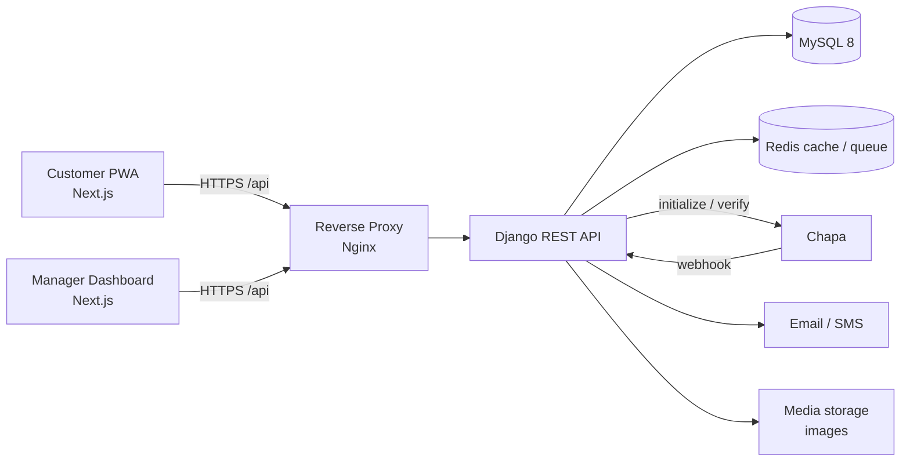
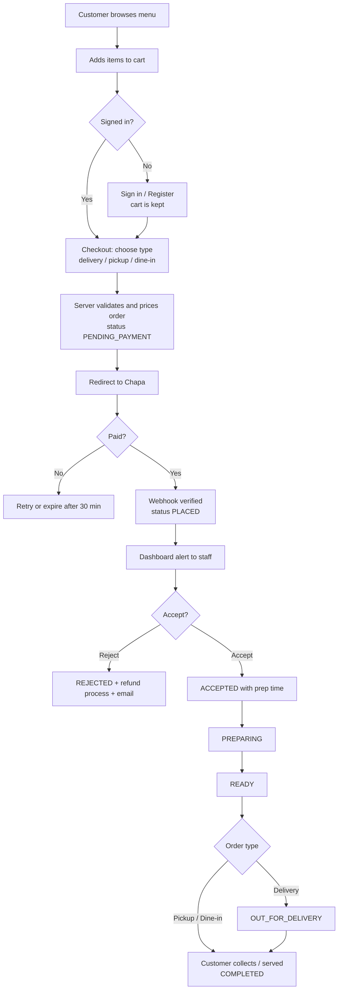

# Software Requirements Specification (SRS)

## Cafe Online Ordering & Management System

|  |  |
| --- | --- |
| **Version** | 1.0 (Draft for approval) |
| **Date** | October 2026 |
| **Stack** | Next.js (frontend), Django 5 + Django REST Framework (backend), MySQL 8, Chapa (payments) |
| **Delivery** | Customer: installable web app (PWA). Admin/Manager: web dashboard |

---

## 1. Introduction

### 1.1 Purpose

This document defines what the system must do and how it must behave, so designers, developers, testers and the cafe owner share one clear reference.

### 1.2 Scope

A single-cafe system where customers order **coffee, tea, other drinks and fast food** for **home delivery, pickup, or dine-in (table order)**. Staff receive paid orders in real time, prepare them, and hand them over or send them out. The owner/manager monitors everything live from a dashboard. Payment is online through **Chapa (ETB)**.

### 1.3 Definitions

| Term | Meaning |
| --- | --- |
| Order type | DELIVERY, PICKUP or DINE_IN |
| tx_ref | Unique reference for one Chapa payment attempt |
| PWA | Progressive Web App: a website installable on a phone like an app |
| RBAC | Role-based access control |
| Snapshot | Copy of name/price saved on an order so later menu changes do not alter old orders |

### 1.4 Design constraint

The existing UI/UX design (Playfair Display + Manrope fonts, dark theme `#3b141c` / `#131313`, gold accent `#fbbb50`, Material Symbols icons, Tailwind CSS) is **fixed**. New screens (checkout, account, manager) must reuse the same tokens and components. No redesign.

---

## 2. Overall Description

### 2.1 Product perspective

One web platform with two experiences sharing one backend:

- **Customer app (PWA):** browse, order, pay, track.
- **Admin/Manager dashboard:** live orders, menu, reports, settings.

### 2.2 User roles

| Role | Can do |
| --- | --- |
| **Guest** | Browse menu, fill a cart. Must sign in to check out |
| **Customer** | Order, pay, track, history, reorder, saved addresses |
| **Staff (Kitchen/Barista)** | See paid orders, change preparation status |
| **Manager** | Everything staff can, plus menu, prices, zones, reports, settings |
| **Owner/Admin** | Everything, plus user management, audit logs, Django admin |

### 2.3 Assumptions and dependencies

- Chapa merchant account (test keys first, live keys later).
- Customers have a smartphone/browser and internet.
- Email service (SMTP) is available. SMS is optional.
- One cafe, one location, one currency (ETB).

---

## 3. System Architecture



### 3.1 Architecture decisions

1. **Same-origin API:** the browser talks to one domain; `/api` is proxied to Django. This makes httpOnly cookie auth safe and simple.
2. **Layered backend:** each Django app has `models`, `serializers`, `services` (business logic), `views` (thin), `permissions`, `tests`. Views never contain business rules.
3. **Real-time:** Server-Sent Events or WebSocket (Django Channels + Redis) for the dashboard. Fallback: polling every 10 seconds.
4. **Stateless API:** authentication by JWT in httpOnly cookies.
5. **Containers:** Docker Compose runs frontend, backend, MySQL, Redis, Nginx.

### 3.2 Folder structure

```
cafe-system/
├── docker-compose.yml
├── .env.example
├── README.md
├── frontend/
│   ├── app/
│   │   ├── (customer)/        menu, cart, checkout, orders, account
│   │   ├── (manager)/manager/ dashboard, orders, menu, reports, settings
│   │   └── layout.tsx
│   ├── components/            ui/, menu/, cart/, orders/, manager/
│   ├── lib/                   api client, formatters, constants
│   ├── hooks/                 useCart, useOrders, useLiveOrders
│   ├── middleware.ts          route protection
│   └── public/                manifest.json, service worker, icons
└── backend/
    ├── config/                settings (base/dev/prod), urls
    └── apps/
        ├── accounts/          users, addresses, roles
        ├── menu/              categories, items, options
        ├── cart/
        ├── orders/            orders, status flow, history
        ├── payments/          Chapa client, webhook
        ├── notifications/     email/SMS, in-app
        ├── dashboard/         reports, live feed
        └── core/              shared helpers, settings model, audit log
```

---

## 4. Functional Requirements

Priority: **M** = must, **S** = should, **C** = could.

### 4.1 Authentication and accounts

| ID | Requirement | P |
| --- | --- | --- |
| FR-A1 | Register with name, email, phone (Ethiopian format), password | M |
| FR-A2 | Login/logout using JWT in httpOnly cookies; silent refresh | M |
| FR-A3 | Password reset by email link with expiry | M |
| FR-A4 | Guests may browse and build a cart; cart is kept and merged on sign-in | M |
| FR-A5 | Profile: edit info, manage saved addresses, set default | M |
| FR-A6 | Role-based access enforced on frontend routes and backend endpoints | M |
| FR-A7 | Email verification of new accounts | S |
| FR-A8 | Login with phone OTP | C |

### 4.2 Menu

| ID | Requirement | P |
| --- | --- | --- |
| FR-M1 | Categories are data-driven: Coffee, Tea, Other Drinks, Fast Food (Burger, Pizza, Sandwich, etc.) and more can be added | M |
| FR-M2 | Item has name, description, image, price, category, availability, preparation time | M |
| FR-M3 | Variants (size: small/medium/large; hot/iced) with price changes | M |
| FR-M4 | Add-ons (extra shot, milk type, extra cheese, sauce) with price | M |
| FR-M5 | Search, category filter, sort by price/popularity, "Popular" and "New" tags | M |
| FR-M6 | Item marked "sold out" instantly by staff without deleting it | M |
| FR-M7 | Daily specials and time-based availability (e.g., breakfast menu) | C |
| FR-M8 | Allergen and dietary labels (vegan, contains dairy, spicy) | S |

### 4.3 Cart and checkout

| ID | Requirement | P |
| --- | --- | --- |
| FR-C1 | Add, remove, change quantity, choose variant and add-ons, per-item note | M |
| FR-C2 | Cart persists (localStorage for guests, database for signed-in users) | M |
| FR-C3 | Order types: **Delivery** (address + zone), **Pickup** (time slot), **Dine-in** (table number or QR) | M |
| FR-C4 | Server recalculates subtotal, delivery fee, tax and total; client prices are ignored | M |
| FR-C5 | Block checkout when cafe is closed or an item became unavailable, with a clear message | M |
| FR-C6 | Schedule an order for later (pickup/delivery time) | S |
| FR-C7 | Promo/discount codes | C |

### 4.4 Payment (Chapa)

| ID | Requirement | P |
| --- | --- | --- |
| FR-P1 | Backend creates the order (PENDING_PAYMENT) and a Payment with a unique `tx_ref` | M |
| FR-P2 | Backend calls Chapa *Initialize*, returns `checkout_url`; frontend redirects | M |
| FR-P3 | Webhook receives result, verifies the signature, then calls Chapa *Verify* before marking PAID | M |
| FR-P4 | Webhook handling is idempotent (duplicates do not double-process) | M |
| FR-P5 | Return page shows success/failure by asking the backend (not by trusting URL parameters) | M |
| FR-P6 | Retry payment on a pending order creates a new `tx_ref` | M |
| FR-P7 | Unpaid orders expire automatically after 30 minutes | M |
| FR-P8 | Manager can mark a refund and record the reason (refund executed via Chapa dashboard or API) | S |
| FR-P9 | Cash on delivery / pay at cafe option (switchable by manager) | C |

### 4.5 Order processing

| ID | Requirement | P |
| --- | --- | --- |
| FR-O1 | Only paid orders (PLACED) appear to staff | M |
| FR-O2 | Staff can accept, reject (with reason), and move through the statuses | M |
| FR-O3 | Manager sets estimated preparation time; customer sees countdown | M |
| FR-O4 | Customer sees live status timeline and gets notified on each change | M |
| FR-O5 | Every status change is stored with who and when | M |
| FR-O6 | Printable kitchen ticket and customer receipt | S |
| FR-O7 | Customer can cancel only before ACCEPTED; later cancellations go through staff | M |
| FR-O8 | Reorder a past order in one tap | S |
| FR-O9 | Customer rates the order and leaves feedback after completion | S |

### 4.6 Admin / Manager dashboard

| ID | Requirement | P |
| --- | --- | --- |
| FR-D1 | **Live board** of orders in columns: New, Preparing, Ready, Out for delivery | M |
| FR-D2 | Sound and visual alert when a new paid order arrives | M |
| FR-D3 | Order detail: items, add-ons, notes, customer contact, address/table, payment status | M |
| FR-D4 | Filters: status, date, type; search by order number or phone | M |
| FR-D5 | Menu management: create, edit, delete, upload images, availability, prices | M |
| FR-D6 | Delivery zones and fees management | M |
| FR-D7 | Cafe settings: open/close switch, opening hours, default prep time, tax rate, contact info | M |
| FR-D8 | Real-time KPIs: orders today, revenue today, average prep time, pending count | M |
| FR-D9 | Reports: daily/weekly/monthly sales, top items, peak hours, order type split, export CSV | M |
| FR-D10 | Staff account management and roles | M |
| FR-D11 | Audit log of sensitive actions (price change, refund, role change) | S |
| FR-D12 | Low-activity and long-wait alerts (order stuck in a status too long) | S |
| FR-D13 | Customer list and order history per customer | S |

### 4.7 Notifications

| ID | Requirement | P |
| --- | --- | --- |
| FR-N1 | Email on order placed, accepted, ready, out for delivery, completed, rejected | M |
| FR-N2 | In-app live status updates for the customer | M |
| FR-N3 | Browser/PWA push notifications | S |
| FR-N4 | SMS notifications (Ethiopian provider) | C |

---

## 5. Process Requirements (Order Workflow)

### 5.1 End-to-end flow



### 5.2 Status rules

| From | Allowed next |
| --- | --- |
| PENDING_PAYMENT | PLACED, EXPIRED, CANCELLED |
| PLACED | ACCEPTED, REJECTED, CANCELLED |
| ACCEPTED | PREPARING, CANCELLED (manager only) |
| PREPARING | READY |
| READY | OUT_FOR_DELIVERY (delivery only), COMPLETED |
| OUT_FOR_DELIVERY | COMPLETED |

Invalid jumps are rejected by one central function (`change_order_status`) so rules live in one place.

### 5.3 Customer guide (how to use it as an app)

1. Open the website on a phone. Choose **"Add to Home Screen" / "Install"**; the cafe icon appears like an app.
2. Browse by category or search; tap an item, choose size and extras, tap **Add**.
3. Open the cart, review, tap **Checkout**. Sign in or register once; next time details are remembered.
4. Choose **Delivery**, **Pickup** or **Dine-in** (scan the table QR or enter the table number).
5. Tap **Pay with Chapa** and finish payment.
6. Watch the **Order Tracking** screen: Placed, Accepted, Preparing, Ready, On the way, Completed.
7. Find old orders in **My Orders** and tap **Reorder**.

A short in-app onboarding (3 screens) and a Help/FAQ page will present this to first-time users.

---

## 6. Product Requirements

- **Menu groups:** Coffee (espresso, latte, macchiato, Ethiopian traditional coffee), Tea, Other Drinks (juice, smoothies, soft drinks, water), Fast Food (burger, pizza, sandwiches, sides).
- **Pricing:** ETB, two decimals, tax shown separately if applicable, delivery fee by zone.
- **Availability:** per item, per time of day, and global open/closed.
- **Languages:** English first; Amharic-ready (all text in translation files, not hard-coded).
- **Platforms:** modern mobile browsers, desktop browsers, installable PWA.

---

## 7. User Interface Requirements

### 7.1 Design system (fixed)

| Token | Value |
| --- | --- |
| Headings | Playfair Display |
| Body | Manrope |
| Background | `#131313` |
| Surface/brand | `#3b141c` |
| Accent | `#fbbb50` |
| Icons | Material Symbols |
| Styling | Tailwind CSS with tokens in `tailwind.config` |

### 7.2 Screens

**Customer:** Home, Menu, Item detail, Cart, Checkout, Payment result, Order tracking, My orders, Profile and addresses, Login/Register/Reset, Help. **Manager:** Login, Live board, Orders list/detail, Menu manager, Zones, Reports, Staff, Settings.

### 7.3 UI rules

- Mobile-first, responsive from 320 px up.
- Every screen has loading (skeleton), empty and error states.
- Touch targets at least 44 px; accessible labels; keyboard navigation; WCAG 2.1 AA contrast.
- Manager screens must work on a tablet in the kitchen (large buttons, readable at distance).
- New screens are shown to the owner for approval before final build.

---

## 8. Database Design (MySQL 8)

### 8.1 Main tables

| Table | Key fields |
| --- | --- |
| `users` | id, email (unique), phone, name, password_hash, role, is_active, created_at |
| `addresses` | user_id, label, street, zone_id, notes, is_default |
| `delivery_zones` | name, delivery_fee, is_active |
| `categories` | name, slug, icon, sort_order, is_active |
| `menu_items` | category_id, name, description, image, base_price, prep_minutes, is_available, is_popular |
| `item_variants` | menu_item_id, name, price_change |
| `add_ons` | menu_item_id, name, price |
| `carts`, `cart_items` | user_id, item, variant, quantity, note |
| `orders` | order_number (unique), customer_id, order_type, table_number, status, subtotal, delivery_fee, tax, total, delivery_address_snapshot, phone_snapshot, notes, estimated_prep_minutes, rejection_reason, placed_at |
| `order_items` | order_id, item_name, variant_name, unit_price, quantity, note (snapshots) |
| `order_item_add_ons` | order_item_id, name, price (snapshots) |
| `payments` | order_id (FK, many per order), tx_ref (unique), chapa_reference, amount, currency, status, raw_response (JSON), created_at |
| `order_status_history` | order_id, status, changed_by, note, created_at |
| `notifications` | user_id, channel, type, status, sent_at |
| `reviews` | order_id, rating, comment |
| `cafe_settings` | is_open, opening_hours, default_prep_minutes, tax_rate, contact info |
| `audit_logs` | actor_id, action, target, before/after, created_at |

### 8.2 Database rules

- Money uses `DECIMAL(10,2)`, never float.
- Foreign keys with proper `ON DELETE` rules; orders and payments are never hard-deleted (soft delete / status).
- Indexes: `orders(status, created_at)`, `orders(customer_id)`, `payments(tx_ref)`, `menu_items(category_id, is_available)`.
- Character set `utf8mb4` (supports Amharic).
- Order and payment creation inside one atomic transaction.
- Daily automated backup, tested restore monthly.
- Passwords stored hashed (Argon2 or PBKDF2); no card data is stored (Chapa handles it).

---

## 9. API Specification (summary)

Base path `/api/v1/`, JSON, consistent error format `{ "error": { "code": "...", "message": "...", "fields": {} } }`. Swagger docs by drf-spectacular.

| Area | Endpoints |
| --- | --- |
| Auth | `POST auth/register`, `login`, `logout`, `refresh`, `password-reset`, `GET/PATCH auth/me` |
| Menu | `GET menu/categories`, `GET menu/items?category=&search=&ordering=`, `GET menu/items/{id}` |
| Cart | `GET/PUT cart`, `POST cart/items`, `DELETE cart/items/{id}`, `POST cart/merge` |
| Orders | `POST orders`, `GET orders`, `GET orders/{number}`, `POST orders/{number}/cancel`, `POST orders/{number}/reorder` |
| Payments | `POST payments/initialize`, `POST payments/webhook`, `GET payments/verify/{tx_ref}` |
| Manager | `GET manager/orders`, `POST manager/orders/{id}/status`, `GET/POST/PATCH manager/menu`, `zones`, `settings`, `staff` |
| Reports | `GET manager/reports/sales`, `top-items`, `peak-hours` |
| Live | `GET manager/live` (SSE/WebSocket stream) |

---

## 10. Real-Time Monitoring

- New paid orders, status changes and sold-out toggles are pushed instantly to the dashboard.
- Live KPI tiles update without refreshing.
- Customer tracking page updates itself when staff change status.
- System health view for the admin: failed payments, webhook errors, orders stuck too long, API error rate.
- Optional hardware (future): kitchen display screen and receipt printer. Physical sensors (e.g., temperature) are out of scope for version 1.

---

## 11. Non-Functional Requirements

| ID | Category | Requirement |
| --- | --- | --- |
| NFR-1 | Performance | Pages load under 3 s on 4G; API responses under 500 ms for 95% of requests; live updates reach the dashboard under 3 s |
| NFR-2 | Scalability | Support 200 concurrent users and 1,000 orders/day without redesign |
| NFR-3 | Availability | 99.5% monthly uptime; graceful message if payment provider is down |
| NFR-4 | Reliability | No lost or duplicated paid orders (idempotent webhooks, atomic transactions) |
| NFR-5 | Usability | New customer can complete first order in under 3 minutes without help |
| NFR-6 | Compatibility | Latest two versions of Chrome, Safari, Firefox, Edge; Android 8+ and iOS 15+ browsers |
| NFR-7 | Accessibility | WCAG 2.1 AA |
| NFR-8 | Maintainability | Readable code standards (Section 13), 80%+ test coverage on business logic |
| NFR-9 | Localization | UTF-8, Amharic-ready text, Ethiopian time zone (EAT, UTC+3), ETB formatting |
| NFR-10 | Data retention | Orders kept at least 5 years; logs 90 days |
| NFR-11 | Observability | Structured logs, error tracking (e.g., Sentry), uptime monitoring |
| NFR-12 | Recoverability | Backups daily; recovery within 4 hours |

---

## 12. Security Requirements

| Area | Control |
| --- | --- |
| **SQL injection** | Django ORM with parameterized queries only. Raw SQL banned unless reviewed and parameterized. All inputs validated by serializers |
| **XSS** | React escapes output; no `dangerouslySetInnerHTML`; Content-Security-Policy header |
| **CSRF** | SameSite cookies + CSRF token on state-changing requests |
| **Auth** | httpOnly, Secure cookies; short-lived access token; refresh rotation; lockout/rate limit after repeated failures |
| **Authorization** | RBAC plus object-level checks (customers see only their own orders) |
| **Payments** | Chapa secret key only on server; webhook signature verified; amount and status re-verified with Chapa; server-side pricing |
| **Transport** | HTTPS only, HSTS, secure headers |
| **Passwords** | Strong hashing, minimum length, common-password check |
| **Secrets** | In environment variables, never in code or git |
| **Uploads** | Check file type and size; rename files; images only |
| **Rate limiting** | On login, register, password reset, order and payment endpoints |
| **Privacy** | Collect only necessary data; customer can request account deletion; personal data not written to logs |
| **Dependencies** | Automated vulnerability scanning and regular updates |
| **Database** | Separate DB user with least privilege; not publicly exposed; encrypted backups |
| **Audit** | Sensitive actions recorded with actor and time |

---

## 13. Code Quality Standards (readable, understandable code)

1. **Clear names:** `calculate_order_total`, not `calc`. No one-letter variables except loop counters.
2. **Small functions:** one job each, ideally under 30 lines.
3. **Business logic in `services.py`,** not in views or components. Views only receive the request, call a service, return the response.
4. **No magic values:** statuses, roles and order types are enums/constants in one file.
5. **Comments explain *why*,** not *what*. Every module has a short header describing its purpose.
6. **Consistent style:** Python with Black + Ruff; TypeScript with ESLint + Prettier; strict TypeScript, no `any`.
7. **Frontend:** small reusable components, data fetching in hooks, forms validated with Zod, no duplicated UI code.
8. **No duplicated logic:** price calculation exists in one backend function only.
9. **Tests:** pricing, status transitions, permissions, webhook flow (Chapa mocked).
10. **Code review checklist** and pull-request rule: nothing merges without passing tests and lint.
11. **Documentation:** README setup steps, `.env.example`, Swagger API docs, short architecture notes.

---

## 14. Additional Requirements (not mentioned but recommended)

- **Table QR codes** for dine-in: each table has a QR that opens the menu with the table number prefilled.
- **Business rules:** minimum order amount, maximum items per order, busy-mode (increase prep time or pause new orders).
- **Receipts and invoices** with order number and tax details.
- **Refund and cancellation policy** page; Terms of Service and Privacy Policy pages.
- **Customer support:** contact/help page, call button, and issue reporting on an order.
- **Loyalty points** (later phase).
- **Offline friendliness:** cached menu and clear "no connection" screen in the PWA.
- **SEO and sharing:** meta tags, sitemap, Open Graph images for the menu.
- **Analytics:** privacy-friendly page and conversion tracking.
- **Staff shift view:** who handled which orders.
- **Error pages:** friendly 404/500.
- **Time zone and holidays:** custom closed days.
- **Environment separation:** development, staging (Chapa test mode), production (Chapa live).

---

## 15. Testing and Acceptance

| Level | Scope |
| --- | --- |
| Unit | Pricing, status rules, permissions, validators |
| Integration | API + MySQL, Chapa sandbox payment, webhook retries |
| End-to-end | Guest to sign in to pay to staff accept to completed |
| Security | Injection and auth tests, dependency scan |
| Performance | Load test at 200 concurrent users |
| Usability | 5 real users complete an order without help |

**The system is accepted when:** all Must requirements pass; a test order completes from menu to COMPLETED for each order type; duplicate webhooks never double-process; a customer cannot read another customer's order; the dashboard shows a new paid order within 3 seconds.

---

## 16. Deployment and Operations

- Docker Compose for development and production; Nginx with HTTPS (Let's Encrypt).
- Environments: dev, staging, production, each with its own `.env`.
- CI pipeline: lint, tests, build on every pull request.
- Media storage: local in development, S3/Cloudinary in production.
- Monitoring, daily backups, and a written rollback procedure.
- Webhook URL must be publicly reachable (use ngrok in development).

---

## 17. Development Phases

| Phase | Deliverable |
| --- | --- |
| 1 | Project setup, Docker, MySQL models, migrations, admin |
| 2 | Authentication and roles |
| 3 | Menu API connected to the existing UI |
| 4 | Cart and checkout (all three order types) |
| 5 | Chapa payment and webhook |
| 6 | Order tracking, live manager dashboard, reports |
| 7 | Notifications, PWA install, security hardening, final tests, deployment |

---

## 18. Risks

| Risk | Mitigation |
| --- | --- |
| Chapa downtime or delayed webhook | Verify endpoint fallback, "payment pending" recovery job |
| Order missed by staff | Sound alerts, long-wait alerts, optional SMS to manager |
| Wrong prices from client | Server-only price calculation |
| Menu changes affect old orders | Snapshot fields on orders |
| Scope growth | Must/Should/Could priorities; Could items only after launch |

---

## 19. Open Questions for the Owner

1. Delivery areas and fees (can be entered later in the admin panel).
2. Opening hours and whether cash payment will be allowed.
3. Is tax/VAT included in prices or added at checkout?
4. Who delivers: own riders or a third party?
5. Is Amharic needed at launch?
6. Will staff use a tablet or printer in the kitchen?